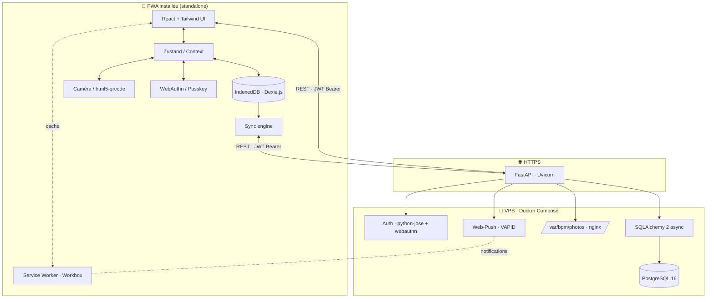
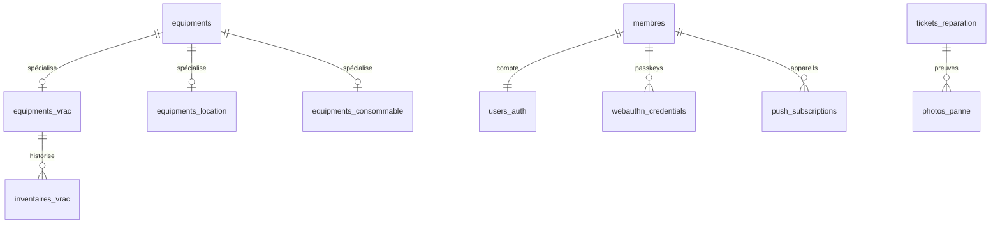
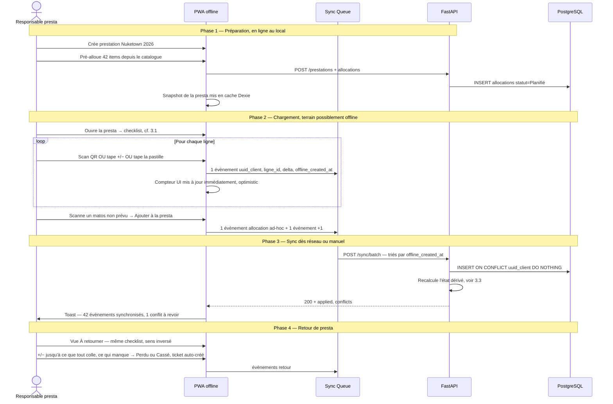

# BPM Log — Plan d'architecture & plan d'action

> Application PWA offline-first de gestion du parc matériel de l'association BPM.
> Backend FastAPI / PostgreSQL · Frontend React + TypeScript + Vite + Tailwind · PWA installable.

---

## 0. Décisions actées

| Sujet | Décision |
|---|---|
| Nom interne | **BPM Log** |
| Base de données | **PostgreSQL** (multi-user concurrent, parc < 500 items mais croissance possible) |
| Auth | **JWT classique** + **WebAuthn / Passkey** dès la V1 (déverrouille un refresh token local après le 1er login mdp) |
| Rôles | **RBAC strict** dès le départ : `Admin`, `Staff`, `Tech` |
| Stack frontend | React 18 + TypeScript + Vite + **Tailwind** + Dexie.js + `vite-plugin-pwa` |
| Stack backend | FastAPI + SQLAlchemy 2.x async + `asyncpg` + Pydantic v2 + Alembic |
| Repo | **Monorepo** `bpm-log/` (backend + frontend + db + docs) |
| Hébergement | **VPS perso de l'asso**, Docker Compose (backend, db, nginx, minio optionnel) |
| Stockage photos | Filesystem du VPS, servi par nginx (chemin signé court-vivant) |
| QR codes | **UUID opaque** généré côté app, étiquettes imprimées depuis l'app. Réimpression = même UUID |
| Offline scope | Scans entrée/sortie · création tickets réparation · consultation catalogue |
| Online-only | Création d'équipement · gestion users · admin · allocation initiale presta |
| Workflow critique #1 | **Sortie matos pour presta** (scan en masse OU validation visuelle de la liste pré-établie) |
| Design | Noir & blanc sobre, **hybride aéré/dense**, inspirations Vercel + Notion, icônes **Google Material Symbols** |
| Police | `Inter` (déjà utilisée sur Site-BPM) + `Compressa VF` pour les titres marketing si besoin |

---

## 1. Architecture cible



### Principes directeurs

1. **Offline-first borné** : seules les opérations terrain critiques (scan + ticket) tournent hors-ligne. La création d'équipement, l'admin et l'allocation initiale de presta sont online-only — ça évite 80 % des conflits sans sacrifier l'usage réel.
2. **Idempotence garantie** : tout évènement créé offline porte un `uuid_client` généré au scan. Le serveur dédoublonne via `ON CONFLICT (uuid_client) DO NOTHING`.
3. **Chronologie respectée, first-write-wins** : chaque mouvement porte `offline_created_at` (heure du téléphone, UTC). Le serveur applique les mouvements triés par cette date. Pour un même item, **le premier évènement chronologique fixe l'état** ; les évènements ultérieurs contradictoires sont enregistrés dans le log mais retournés en `conflicts[]` pour arbitrage humain (voir §3.3).
4. **PWA installable** : `manifest.json` + service worker précachant le shell. L'app doit fonctionner même sans réseau au lancement.
5. **Sécurité boundary-only** : Pydantic v2 valide tout ce qui entre, SQLAlchemy ne fait jamais confiance aux strings. CORS strict. Tous les endpoints `/api/*` exigent JWT sauf `/auth/login` et `/auth/webauthn/*`.

---

## 2. Modèle de données révisé

Modifications par rapport au MCD initial (`MCD.dbml`) :

| # | Changement | Raison |
|---|---|---|
| 1 | `statut_actuel`, `type_action`, `avancement`, `prestations.statut`, `prestations.type`, `allocations_presta.statut` → **ENUM PostgreSQL** | Cohérence, autocomplétion Pydantic, refus de valeurs invalides |
| 2 | Ajout `uuid_client UUID UNIQUE` et `offline_created_at TIMESTAMPTZ` sur `logs_scans` et `tickets_reparation` | Idempotence + ordre chronologique de la sync |
| 3 | Nouvelle table `inventaires_vrac` historisée (`equipment_id`, `membre_id`, `quantite_constatee`, `date`, `presta_id?`, `note`) | Tracer **qui** a constaté **quand** un manque sur une caisse |
| 4 | Nouvelle spécialisation `equipments_consommable` (PK = FK vers `equipments`, `stock_actuel int`, `seuil_alerte int`, `unite varchar`) | Modéliser gaffer / piles / scotch sans complexifier le tronc commun |
| 5 | Nouvelle table `photos_panne` (`id`, `ticket_id`, `chemin`, `created_at`, `membre_id`) | Joindre des photos aux tickets de réparation |
| 6 | Nouvelle table `users_auth` séparée de `membres` (`membre_id` FK unique, `password_hash`, `last_login`, `is_active`) + table `webauthn_credentials` (`id`, `membre_id`, `credential_id bytea`, `public_key bytea`, `sign_count int`, `device_name`) | Sépare l'identité métier (membre asso) de l'identité technique (compte). Permet plusieurs Passkeys par membre (téléphone perso + laptop perso) |
| 7 | Nouvelle table `push_subscriptions` (`id`, `membre_id`, `endpoint`, `p256dh`, `auth`, `created_at`) | Web-Push VAPID |
| 8 | Pas de soft-delete temporel : ajout d'un statut `Réformé` dans l'ENUM `statut_actuel` pour indiquer qu'un matos est officiellement sorti du parc | Tu veux pouvoir « fail » un matos sans date, c'est exactement ça |
| 9 | `barcode_uid` reste stable et réimprimable (pas de table `qr_codes` séparée) | Décision validée |
| 10 | `allocations_presta` : ajout `quantite int default 1` (utile pour les consommables et le vrac dans une presta) | Permet "j'alloue 5 rouleaux de gaffer à cette presta" |

### Diagramme synthétique des ajouts



Le fichier `MCD.dbml` sera mis à jour à la fin du Milestone 1 pour refléter ces changements.

---

## 3. Workflow métier : sortie / retour de prestation

C'est **le** scénario critique. Il doit être ultra fluide.

### 3.1 UI checklist unifiée (sortie, retour, vrac, consommables)

Pas de bouton "tout valider" global. À la place, **une seule métaphore réutilisée partout** : une checklist avec, par ligne, un compteur `−` / valeur / `+` et une coche de validation, façon :

```text
┌─────────────────────────────────────────────────────────┐
│  CHECKLIST · Sortie Nuketown 2026                       │
├─────────────────────────────────────────────────────────┤
│ ⊙  Lyre Beam 7R           4/6 vérifié    [−]  4  [+]    │
│ ✓  Ampli Crown XTi        2/2 vérifié    [−]  2  [+]    │  ← vert quand prévu == vérifié
│ ⊙  Câble XLR 10m         15/20 vérifié   [−] 15  [+]    │
│ ⊙  Adaptateur M/F         7/8 vérifié    [−]  7  [+]    │
├─────────────────────────────────────────────────────────┤
│              [ Valider la sortie complète ]             │  ← grisé tant que ≥ 1 ligne incomplète
└─────────────────────────────────────────────────────────┘
```

Règles d'interaction :
- **Cas unitaire** (1 item = 1 ligne) : compteur 0/1, `+` valide, `−` annule.
- **Cas quantitatif** (vrac, consommables, items identiques alloués en lot) : `+` / `−` ajustent ; la valeur sous-titre `X/Y vérifié` passe en vert quand `X == Y`.
- **Le scan QR est juste un raccourci pour `+1` sur la bonne ligne** — si l'item scanné n'est pas dans la liste, modal "Ajouter à la presta ?" qui crée une ligne ad-hoc.
- La pastille de gauche (`⊙` / `✓`) indique l'état global de la ligne ; tap dessus = bascule "tout vérifié pour cette ligne" (raccourci).
- Le bouton bas n'est PAS un "tout valider" magique — il **confirme** la session après que chaque ligne est cohérente. Il reste grisé sinon, avec en sous-texte "3 lignes incomplètes".
- Toute action sur le compteur génère un évènement avec `uuid_client` immédiatement empilé dans la queue offline.

Cette UI sert pour : **sortie presta**, **retour presta**, **inventaire vrac**, **réappro consommables**. Une seule lib de composants, un seul modèle mental pour l'utilisateur.

### 3.2 Séquence end-to-end



À la clôture de la presta, l'app liste les items dont `quantite_retournee < quantite_sortie` → l'utilisateur tranche pour chacun : *retourné quand même · perdu · cassé · laisser ouvert*.

---

## 3.3 Stratégie de résolution des conflits offline

C'est le point le plus subtil de l'archi. Voici le modèle et les scénarios concrets.

### Principe fondateur : **le log d'évènements est la vérité**

Au lieu d'envoyer "mets le statut de la Lyre #5 à Sorti", le client envoie **un fait historique** : "à 14:02:13 (heure tel), l'utilisateur U a scanné Lyre #5 en SORTIE pour la presta P, uuid_client=abc-123".

Conséquences directes :
1. **Le log (`logs_scans`) est append-only**. Deux personnes peuvent enregistrer le même fait, ce sont juste deux lignes de plus. L'idempotence sur `uuid_client` empêche seulement le double-envoi du **même** évènement par le **même** client.
2. **L'état dérivé** (`equipments.statut_actuel`, `allocations_presta.statut`, `equipments_consommable.stock_actuel`) est **recalculé** par le serveur à partir du log à chaque batch syncé. Plus de problème "lequel a raison" : c'est l'évènement le plus récent qui parle.
3. **Les compteurs (vrac, consommables) sont stockés en deltas** (`+3`, `−2`), pas en valeurs absolues. Les deltas sont commutatifs → ordre d'arrivée sans importance, somme déterministe.

### Les 4 catégories de conflits, et comment chacune est tranchée

| # | Type de conflit | Détection | Résolution |
|---|---|---|---|
| **A** | Même client renvoie le même évènement (retry réseau) | `uuid_client` déjà en base | `ON CONFLICT DO NOTHING` côté serveur. Silencieux. |
| **B** | Deux users posent un état **différent** sur le même item unique (ex : A dit "Sorti", B dit "En panne") | À l'application de l'évènement, le statut courant a déjà été fixé par un évènement antérieur | **First-write-wins** par `offline_created_at`. L'état dérivé reste celui du premier évènement ; le second est conservé dans le log et **remonté en `conflicts[]`** pour qu'un Admin/Staff tranche. Pas d'écrasement silencieux. |
| **C** | Deux users incrémentent un compteur (vrac, consommable) en parallèle | Aucune — les deltas s'additionnent | **Commutatif**. `stock = theorique + Σ deltas validés`. Pas de perte. |
| **D** | Conflit **métier** non résolvable automatiquement (ex : Lyre #5 sortie sur 2 prestas simultanées) | Règle métier violée au moment du replay serveur | Les deux évènements restent dans le log. Le serveur **flague** un `BusinessConflict` retourné dans la réponse sync. UI affiche un écran "à arbitrer" à un Admin. |

### Scénario A — Retry réseau (le plus courant)

```
14:02:13  Alice scanne Lyre #5 SORTIE  → uuid abc-123 en queue
14:05:00  Sync part. Réseau coupe à mi-chemin. Client ne reçoit pas l'ACK.
14:05:30  Client retry → renvoie abc-123.
Serveur  : INSERT ... ON CONFLICT (uuid_client) DO NOTHING → 0 rows inserted, 200 OK.
```
→ Aucune action manuelle. C'est ce que `uuid_client` règle. Tu avais raison de demander "à quoi ça sert" — c'est **exactement** ce cas.

### Scénario B — Deux personnes, même item, états différents

```
13:50  Alice (offline) scanne Lyre #5 → SORTIE presta Nuketown      uuid A
14:10  Bob (offline)   scanne Lyre #5 → EN PANNE                     uuid B
15:00  Alice sync     → log ingère A → état = Sorti
15:05  Bob sync       → log ingère B → conflit détecté : un autre évènement
                                         postérieur à 13:50 a déjà fixé
                                         le statut → état reste Sorti,
                                         B mis en `conflicts[]`
```

**Pourquoi first-write-wins et pas last-write-wins ?** Parce qu'entre 15:00 et 15:05, des collègues online ont pu consulter l'app, voir "Sorti", prendre des décisions ("OK donc cette lyre est sur Nuketown, je ne la réserve pas pour mon évènement"). Si Bob écrasait silencieusement leur réalité à 15:05, ces décisions deviendraient invalides sans personne ne le sache. Le first-write-wins **gèle la réalité partagée** dès qu'elle est connue.

Variante chronologique : Bob scanne effectivement **avant** Alice (13:45 < 13:50) mais sync après. Le serveur replay dans l'ordre `offline_created_at` (13:45 → 13:50), donc B est ingéré en premier dans une transaction par batch — c'est lui qui fixe l'état "En panne", puis A devient le conflit. C'est cohérent : la réalité physique première l'emporte.

Cas particulier où le second évènement est **compatible** avec l'état courant (ex : item déjà Sorti pour la presta P, Bob scanne le retour pour la même presta P) : pas de conflit, l'état avance normalement. La règle s'applique uniquement quand les transitions divergent.

L'écran d'arbitrage propose pour ces cas : *garder l'état actuel et ignorer le second évènement* · *appliquer le second évènement (déclare l'admin que l'info première était erronée)* · *contacter les deux déclarants*.

### Scénario C — Vrac concurrent

```
Caisse XLR 10m, théorique 20.
Alice trouve 15 sur place    → enregistre delta -5      uuid C1
Bob trouve aussi la caisse et confirme 14 unités → delta -1 (par rapport à 15 ?)
```

Pour éviter l'ambiguïté "par rapport à quoi", la règle UI est :
- **L'utilisateur n'entre jamais une valeur absolue** ; le compteur `−`/`+` génère des deltas unitaires.
- Si Alice voit "15" affiché et tape `−1`, le delta envoyé est `-1`. Si Bob voit "15" lui aussi (parce qu'il était hors-ligne en parallèle) et tape `−1`, son delta est aussi `-1`. Résultat fusionné : `20 − 5 − 1 − 1 = 13`. Ce qui est faux (la vraie quantité est 14).

Donc pour le vrac on **n'autorise qu'une seule session d'inventaire ouverte à la fois** sur une caisse :
- Quand Alice ouvre l'inventaire d'une caisse (online), un `inventory_lock` est posé en base (timeout 2h, auto-libéré).
- Bob, online, voit "Inventaire en cours par Alice — rejoindre ?". S'il rejoint, ils sont sur la même session, les `+`/`−` des deux téléphones s'additionnent sainement.
- Bob, offline, ne peut pas démarrer l'inventaire d'une caisse pour laquelle aucun lock préalable n'a été préchargé. La caisse apparaît en lecture seule sur son app.

C'est la seule contrainte forte qu'on impose à l'offline, et elle ne concerne que le vrac.

### Scénario D — Conflit métier (double-allocation)

```
Mardi 10h  Alice prépare presta Nuketown, alloue Lyre #5 (online).
Mardi 14h  Bob (offline depuis 13h) prépare presta Mariage, alloue Lyre #5
            via la version cachée du catalogue (qui ne reflète pas l'action d'Alice).
Mardi 18h  Bob revient online et sync.
```

Serveur détecte : `equipments.id=5` est déjà dans `allocations_presta` avec statut `Sorti` ou `Planifié` pour une autre presta active. Réponse sync :

```json
{
  "applied": [...],
  "conflicts": [
    {
      "type": "double_allocation",
      "equipment_id": 5,
      "equipment_name": "Lyre Beam 7R",
      "existing": {"presta_id": 12, "presta_name": "Nuketown", "since": "..."},
      "attempted": {"presta_id": 18, "presta_name": "Mariage Dupont", "uuid_client": "..."}
    }
  ]
}
```

Côté UI : un badge rouge "1 conflit à arbitrer" apparaît dans le menu. L'écran d'arbitrage propose : *garder Nuketown · transférer à Mariage · dupliquer (créer une 2e ligne) · annuler*. C'est un Admin/Staff qui tranche.

Le même mécanisme couvre : tentative de retour d'un item déjà retourné, modification d'un équipement supprimé entre-temps, allocation d'un consommable épuisé.

### Mitigation préventive : réduire la surface de conflit

- **Préchargement obligatoire** : avant de partir en presta offline, le responsable doit appuyer sur "Préparer pour terrain" qui télécharge la presta + ses allocations + le catalogue à jour. Tant que ce n'est pas fait, l'app refuse de basculer en mode "session presta".
- **Heartbeat de catalogue** : tant que l'app est online, elle pull les deltas catalogue toutes les 60 s. La fenêtre d'inconscience est minimale.
- **Affichage de fraîcheur** : chaque écran montre discrètement "Données à jour il y a 3 min" / "Hors-ligne depuis 12 min". Les utilisateurs développent un réflexe.

### Ce que l'utilisateur doit comprendre (3 lignes)

> Tes scans sont **toujours sauvegardés** sur ton téléphone, même hors-ligne.
> Si deux personnes touchent le même matos de façon contradictoire, **la première action vue par le serveur l'emporte** et la seconde est mise en attente d'arbitrage — personne n'écrase silencieusement.
> Pour les caisses (vrac), **une seule personne à la fois** peut ouvrir l'inventaire.

---

## 4. Structure du monorepo

```text
bpm-log/
├── README.md
├── PLAN.md
├── MCD.dbml                       # MCD à jour avec les ajouts
├── docker-compose.yml             # Stack complète (api, postgres, nginx)
├── .env.example
│
├── backend/
│   ├── pyproject.toml             # On utilise uv ou poetry, pas requirements.txt
│   ├── Dockerfile
│   ├── alembic.ini
│   ├── alembic/                   # Migrations
│   └── app/
│       ├── main.py                # Création FastAPI, CORS, routers
│       ├── config.py              # Settings via pydantic-settings
│       ├── database.py            # async_engine, async_session
│       ├── deps.py                # Dépendances FastAPI (current_user, db)
│       ├── security/
│       │   ├── jwt.py
│       │   ├── passwords.py       # argon2
│       │   ├── webauthn.py
│       │   └── rbac.py            # Décorateurs Role.required(...)
│       ├── models/                # SQLAlchemy ORM
│       ├── schemas/               # Pydantic v2 (Create/Read/Update split)
│       ├── routers/
│       │   ├── auth.py
│       │   ├── equipment.py
│       │   ├── prestations.py
│       │   ├── tickets.py
│       │   ├── sync.py            # POST /sync/batch, GET /sync/pull
│       │   ├── vrac.py
│       │   ├── consommables.py
│       │   ├── photos.py
│       │   └── notifications.py   # subscribe push
│       ├── services/              # Logique métier pure (testable)
│       │   ├── sync_engine.py
│       │   ├── presta_lifecycle.py
│       │   └── push.py            # pywebpush
│       └── jobs/                  # APScheduler ou Celery beat
│           └── presta_overdue.py  # check matos non retourné
│
├── frontend/
│   ├── package.json
│   ├── vite.config.ts             # + vite-plugin-pwa
│   ├── tailwind.config.ts
│   ├── index.html
│   ├── public/
│   │   ├── manifest.webmanifest
│   │   └── icons/
│   └── src/
│       ├── main.tsx
│       ├── app/
│       │   ├── App.tsx
│       │   ├── router.tsx
│       │   └── providers.tsx      # QueryClient, Auth, Theme
│       ├── features/
│       │   ├── auth/              # login mdp + WebAuthn
│       │   ├── catalog/           # liste + recherche équipements
│       │   ├── scan/              # QRScanner.tsx
│       │   ├── prestations/       # vue "À sortir / À retourner"
│       │   ├── tickets/           # création offline + photos
│       │   ├── vrac/              # check-list +/- + inventaire
│       │   └── admin/             # users, catégories, lieux
│       ├── shared/
│       │   ├── ui/                # Button, Sheet, Dialog, EmptyState
│       │   ├── icons/             # Wrapper Material Symbols
│       │   └── layout/
│       ├── db/
│       │   ├── localDb.ts         # Déclaration Dexie
│       │   └── syncQueue.ts
│       ├── services/
│       │   ├── api.ts             # client REST (fetch + retry)
│       │   ├── syncEngine.ts      # vidage queue, idempotence
│       │   └── webauthn.ts
│       └── styles/
│           └── tailwind.css
│
└── docs/
    ├── adr/                       # Architecture Decision Records
    └── api/                       # OpenAPI exporté
```

---

## 5. Design system

Pas de framework UI lourd. Tailwind + composants maison + Material Symbols.

### Palette

```css
--bg:          #0a0a0a    /* fond principal, légèrement moins dur que pur #000 pour usage app prolongé */
--bg-soft:     #141414    /* cards, sheets */
--bg-elev:    #1c1c1c    /* hover, menus */
--border:      rgba(255,255,255,0.10)
--border-strong: rgba(255,255,255,0.20)
--text:        #fafafa
--text-muted:  rgba(255,255,255,0.60)
--text-dim:    rgba(255,255,255,0.40)
--accent:      #ffffff
--success:     #22c55e   /* matos OK / scanné / retourné */
--warning:     #f59e0b   /* en attente, manquant */
--danger:      #ef4444   /* panne, perdu */
```

> Note : `#0a0a0a` au lieu du `#000` pur du site vitrine. Sur un écran AMOLED en plein soleil pendant une presta, le pur noir + contraste max fatigue. On garde l'esprit Site-BPM mais on assouplit pour l'usage prolongé.

### Typographie

- **Inter** (corps, UI, listes) — déjà sur Site-BPM, cohérent.
- **JetBrains Mono** (codes-barres lisibles humainement, IDs techniques).
- Pas de Compressa VF dans l'app — c'est un usage marketing/éditorial du site, hors-sujet ici.

### Densité — règle hybride

- **Écrans d'accueil / dashboard / détail presta** : aérés, gros tap targets (min 44px), façon Site-BPM.
- **Listes catalogue / historiques / scans rapides** : denses, lignes compactes 48px, façon Vercel dashboard / Linear.

### Icônes

[Google Material Symbols](https://fonts.google.com/icons) en variant **Outlined**, weight 300, fill 0.
Intégration via la web font Google Fonts (chargée une fois, cachée par le SW).
Wrapper React :

```tsx
<Icon name="qr_code_scanner" size={24} />
```

### Composants pivots à créer en priorité

`Button`, `IconButton`, `Sheet` (bottom-sheet mobile), `Dialog`, `ListRow`, `EmptyState`, `Toast`, `StatusBadge` (mappé sur les ENUM statuts), `ScanOverlay`, `OfflineIndicator`, `SyncQueueBadge`.

---

## 6. Plan d'action — Milestones

### M1 · Fondations backend (PostgreSQL + FastAPI + Auth JWT)
- `docker-compose.yml` (postgres 16 + adminer)
- `backend/app/main.py`, `database.py`, `config.py`
- Modèles SQLAlchemy + Alembic init + 1ère migration (tables du MCD révisé)
- Endpoints `/auth/login`, `/auth/refresh`, `/me`
- Décorateur `require_role(Role.ADMIN | Role.STAFF | Role.TECH)`
- Swagger sur `/docs` derrière flag debug
- **Pièges** : utiliser **asyncpg** (pas psycopg2), `TIMESTAMPTZ` partout (pas `TIMESTAMP`), Pydantic v2 `ConfigDict(from_attributes=True)` pour les schémas Read.

### M2 · Frontend shell PWA + design system
- Vite + TS + Tailwind + `vite-plugin-pwa` (strategy `injectManifest` pour contrôler le SW)
- `manifest.webmanifest` + icônes 192/512/maskable
- Layout app (bottom tab bar mobile), routing
- Composants `Button`, `ListRow`, `Sheet`, `StatusBadge`, `OfflineIndicator`
- Page login mdp fonctionnelle contre M1
- **Pièges** : tester sur vrai iPhone Safari (la PWA iOS a des quirks majeurs : pas de push avant iOS 16.4, manifest partiellement supporté).

### M3 · Catalogue + cache offline
- Endpoint `GET /equipments?since=` (delta sync)
- Dexie : tables `equipments`, `categories`, `emplacements`, `meta` (`last_pull_at`)
- Service `catalogSync` : pull au login, puis pull périodique en ligne
- Vue catalogue avec recherche full-text côté client (Dexie + fuse.js)
- **Pièges** : limiter la taille du payload initial (champs nécessaires uniquement), pagination si > 500 items.

### M4 · Scanner QR + génération étiquettes
- `html5-qrcode`, ROI 60% de l'écran, résolution forcée 720p, support flash via `MediaStreamTrack.applyConstraints`
- Page "Scanner" : flux continu, feedback haptique (`navigator.vibrate`), son court
- Génération étiquettes côté admin (web) : `qrcode` (npm) + page imprimable A4 (grille 24/page)
- **Pièges** : Safari iOS exige un geste utilisateur pour démarrer la caméra ; permission caméra dans `manifest.permissions`.

### M5 · Sync engine offline + tickets réparation hors-ligne
- Dexie : table `sync_queue` (uuid_client, payload, type, offline_created_at, retry_count, last_error)
- `syncEngine.ts` : flush sur reconnexion (`navigator.onLine` + `online` event + polling 30s), batch de 50, backoff exponentiel, **tri par `offline_created_at` avant envoi**
- Endpoint `POST /sync/batch` : Pydantic valide chaque item, transaction par batch, replay des évènements dans l'ordre chronologique, **recalcul de l'état dérivé**, retourne `{applied[], conflicts[]}` (cf. §3.3)
- Création de tickets offline avec photos (photos stockées en blob Dexie, uploadées séparément après sync du ticket)
- UI "conflits à arbitrer" pour les `BusinessConflict` (scénario D)
- **Pièges** : ne jamais perdre un item de la queue, même sur erreur 500 serveur — marquer `last_error` et garder en file. Ne pas s'appuyer sur l'ordre d'arrivée HTTP, toujours sur `offline_created_at`.

### M6 · Workflow prestations complet
- CRUD prestations (online)
- Allocation matériel (multi-select depuis catalogue, recherche par catégorie/lieu)
- **Checklist unifiée** (§3.1) pour sortie + retour : compteur `−`/`+` par ligne, scan = raccourci `+1`, pas de "tout valider" magique
- Bouton "Préparer pour terrain" : précharge presta + allocations + delta catalogue dans Dexie, bascule l'app en mode session
- Scan d'un item non alloué → modal "Ajouter à la presta ?" qui crée une ligne ad-hoc
- Clôture : récap items dont `retourné < sorti` avec choix individuel (retourné quand même · perdu · cassé · laisser ouvert)
- **Pièges** : la liste pré-établie doit être disponible offline ; refuser le mode session si "Préparer pour terrain" n'a pas été fait.

### M7 · Vrac, consommables, inventaires
- Même composant checklist que §3.1 (`−` / valeur / `+`)
- Enregistrement en **deltas unitaires** (jamais de valeur absolue saisie par l'utilisateur)
- `inventory_lock` posé en base à l'ouverture d'un inventaire vrac (online required), TTL 2h, libération auto ou manuelle ; mode "rejoindre la session" pour les autres users online
- Caisse en lecture seule si pas de lock préchargé localement (offline)
- Page consommables avec `stock_actuel = theorique + Σ deltas` et alerte visuelle sous `seuil_alerte`
- Historique des inventaires par caisse (qui, quand, quoi)

### M8 · WebAuthn / Passkey
- Backend : lib `webauthn` (py-webauthn), endpoints `/auth/webauthn/register/begin|complete` et `/login/begin|complete`
- Frontend : après 1er login mdp réussi, proposer "Enregistrer ce téléphone" → `navigator.credentials.create`
- Stockage local du `refresh_token` chiffré par une clé débloquée par la Passkey
- Fallback mdp toujours disponible
- **Pièges** : `rp.id` doit matcher le domaine exact (sans port, sans `https://`) ; Passkey ne fonctionne pas en `http://` sauf `localhost`.

### M9 · Notifications push
- VAPID keys générées une fois, stockées dans `.env`
- Endpoint `POST /notifications/subscribe`
- Worker `presta_overdue.py` (APScheduler) : tourne toutes les heures, détecte prestas terminées avec items non retournés → push au responsable
- Hook sur création de `tickets_reparation` avec mot-clé urgence → push aux membres rôle `Tech`
- **Pièges** : iOS exige PWA installée + iOS 16.4+ pour les push, prévoir fallback email.

### M10 · Hardening, observabilité, déploiement
- Tests : pytest (backend, ≥ 70% sur services), Vitest + Playwright (frontend critiques : scan, sync, login)
- Logs structurés JSON (`structlog`), erreurs Sentry (optionnel)
- Backup PostgreSQL automatique (cron + `pg_dump` vers stockage off-site)
- Healthchecks Docker
- `docker-compose.prod.yml` avec nginx + Let's Encrypt (Caddy serait plus simple, à considérer)
- Documentation `/admin` pour onboarder un nouveau membre

---

## 7. Risques identifiés & mitigations

| Risque | Impact | Mitigation |
|---|---|---|
| Sync échoue silencieusement, items perdus | Critique | Queue persistante Dexie, jamais supprimer un item avant ACK serveur ; badge "X events en attente" toujours visible |
| Horloge téléphone décalée | Moyen | Capturer aussi `Date.now()` ET un identifiant de session ; le serveur peut détecter un drift > 1h et alerter |
| Permission caméra refusée | Bloquant scan | Fallback : saisie manuelle du `barcode_uid` (input avec scanner physique compatible aussi) |
| iPhone < 16.4 sans push | Moyen | Indicateur in-app + email de relance pour ces utilisateurs |
| Conflits sur `equipments.statut_actuel` (2 personnes scannent en même temps) | Faible | Log append-only, état recalculé par replay chronologique. **First-write-wins** par `offline_created_at`, second évènement contradictoire remonté en `conflicts[]` (cf. §3.3 scénario B) |
| Double-allocation d'un même item sur 2 prestas (offline parallèle) | Moyen | Détecté serveur, retourné dans `conflicts[]`, écran d'arbitrage Admin (cf. §3.3 scénario D) |
| Inventaire vrac concurrent qui s'écrase | Moyen | `inventory_lock` + deltas commutatifs, jamais de valeur absolue côté UI (cf. §3.3 scénario C) |
| Photos qui grossissent le device | Moyen | Compression côté client (`<canvas>` resize à 1280px max, qualité 0.8) avant blob Dexie |
| Perte du téléphone avec Passkey enregistrée | Faible | Compte = un membre, plusieurs credentials WebAuthn possibles ; révocation depuis `/me/devices` ; mdp toujours fallback |
| MCD évolue après M3 | Moyen | Toute évolution = nouvelle migration Alembic, jamais d'édition de migration appliquée |

---

## 8. Ce qui est volontairement HORS V1

Pour cadrer le scope et livrer vite :

- Pas de **scan multi-codes simultanés** (un QR à la fois).
- Pas de **mode tablette / desktop avancé** — mobile-first, le desktop est juste utilisable mais pas optimisé.
- Pas d'**export PDF** (fiche prêt, devis matos).
- Pas de **dashboard statistiques** (taux de panne, top utilisation).
- Pas d'**import CSV** du parc existant — saisie via l'admin web (réalisable en quelques soirées si parc < 500).
- Pas de **multi-association / multi-tenant**.
- Pas de **i18n** (FR uniquement).
- Pas de **mode hors-ligne pour création d'équipement** (online-only).

Tous ces points sont des candidats V2 et n'impactent pas le modèle de données ni l'architecture.

---

## 9. Prochaines étapes immédiates

1. Mettre à jour `MCD.dbml` avec les 10 changements de la section 2.
2. Créer `backend/` avec FastAPI + 1 endpoint `/health` + Alembic init.
3. Créer `frontend/` avec Vite+TS+Tailwind+PWA + page Login statique.
4. `docker-compose.yml` minimal (postgres + adminer) pour le dev local.
5. Premier ADR : `docs/adr/0001-stack-choice.md` figeant les décisions de la section 0.

> Dès que tu valides ce plan, on attaque M1.
